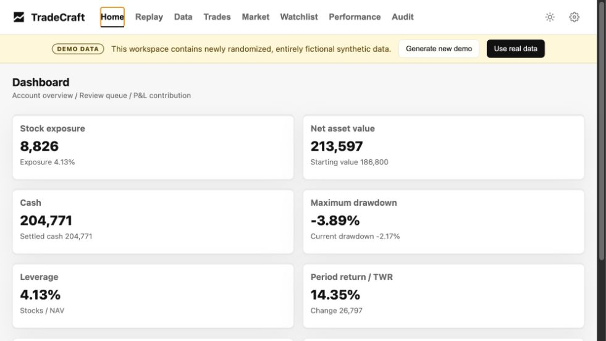
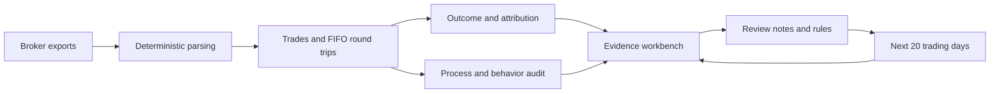

<p align="center">
  
</p>

<h1 align="center">TradeCraft</h1>

<p align="center">
  <strong>The Trade Review System for Serious Traders. Know Yourself. Trade Better.</strong><br>
  A local-first trade review system that helps active traders understand not just what happened, but why—and turn every trade into a better decision.
</p>

<p align="center">
  <a href="README.md">简体中文</a> ·
  <a href="DISCLAIMER.md">Financial disclaimer</a> ·
  <a href="CONTRIBUTING.md">Contributing</a> ·
  <a href="SECURITY.md">Security</a>
</p>



## A P&L number is not a review

You can finish a month profitable and still reinforce a bad process. You can take a loss on a well-planned trade and learn the wrong lesson from it. The difficult part of active trading is rarely finding more data. It is connecting the data you already have:

- executions live in a broker statement;
- the market context lives on a chart;
- the original plan is buried in notes or memory;
- recurring mistakes are felt, but rarely measured;
- the next improvement ends as “be more disciplined.”

TradeCraft brings those fragments into one review loop. It reconstructs each trade, shows what drove the account result, separates process from outcome, and turns a finding into a rule you can test over the next 20 trading days.

| When review feels like this | TradeCraft helps you move toward this |
|---|---|
| “I made money, but I do not know what was repeatable.” | Separate market beta, stock selection, execution, sizing, and concentration. |
| “I remember the trade differently every time.” | Replay BUY and SELL evidence directly on the price chart. |
| “The dashboard gives me a score but not a reason.” | Drill from every audit finding into the underlying round trips and fills. |
| “My journal is full of observations that never change behavior.” | Convert a confirmed issue into a measurable 20-trading-day rule. |
| “I do not want my portfolio history uploaded to another service.” | Keep the workspace local, with no TradeCraft cloud account and no telemetry. |

## What TradeCraft does

TradeCraft turns brokerage exports into a structured, evidence-based trading review. Instead of compressing everything into one score, it keeps four questions separate:

1. **Outcome:** What actually drove the account and individual trade results?
2. **Process:** Were entries, exits, sizing, concentration, and stock selection sound?
3. **Behavior:** Which helpful or harmful patterns keep repeating?
4. **Evidence quality:** What is confirmed, what is only suspected, and what cannot yet be judged?

TradeCraft is not a broker, signal service, or automated trading system. It does not connect to an account, place orders, predict prices, or transmit portfolio data to a TradeCraft cloud service. The application runs on `127.0.0.1`, stores its workspace locally, and includes no telemetry.

> **Important:** TradeCraft is research and journaling software, not investment advice. See [DISCLAIMER.md](DISCLAIMER.md).

## From a trade log to a learning loop

Most trading journals stop after recording what happened. TradeCraft is designed to carry the lesson into the next decision:



The deterministic pipeline remains the source of truth. Optional AI summarizes the current audit snapshot; it does not calculate the underlying results.

## Product tour

TradeCraft is a build-free single-page application with nine primary surfaces.

| Page | What it is for | Key capabilities |
|---|---|---|
| **Home** | Decide what deserves attention now. | Account snapshot, exposure, cash, drawdown, period return, data freshness, review queue, and largest P&L contributors. |
| **Replay** | Reconstruct a symbol-level decision. | Daily candles, volume, moving averages, BUY/SELL markers, fill detail, date/range navigation, measurement tools, trade plans, and review notes. |
| **Data** | See the trading book as a dataset. | Turnover and fill rankings, P&L contribution, treemap views, activity intensity, trading-density charts, and non-stock instrument P&L. |
| **Trades** | Inspect and classify raw executions. | Symbol-grouped fill history, dates, sides, quantities, prices, commissions, setup tags, and notes. |
| **Market** | Add broad market context. | TradingView Nasdaq/S&P 500 heatmaps, YTD views, and Finviz access. These third-party widgets use the network. |
| **Watchlist** | Maintain a local research queue. | SQLite-backed groups, drag sorting, colors, search, batch actions, context menus, TradingView text import, local charts, and trigger fields. |
| **Performance** | Review the account path, not only the ending P&L. | Monthly account values, monthly returns, YTD/cumulative returns, and a local performance-workbook workflow. |
| **Audit** | Separate results, process, behavior, and confidence. | Scorecards, benchmark-relative outcome, seven risk dimensions, evidence drill-down, finding feedback, rule cycles, and optional AI summaries. |
| **Settings** | Control the local workspace. | Language, default period/symbol, refresh interval, Kimi model, benchmarks, data upload/refresh, and Watchlist triggers. |

See every page and sub-tab in the [illustrated Chinese feature guide](output/pdf/TradeCraft_系统功能手册_zh-CN.pdf).

## Core capabilities

### Trade replay

Replay combines market history with execution evidence. Select a symbol and date to see:

- adjusted daily OHLCV candles and volume;
- configurable moving averages;
- BUY and SELL markers tied to fill-level records;
- quick YTD, yearly, and custom ranges;
- measurement and chart-navigation tools;
- current trade plan, invalidation level, holding horizon, setup classification, and review notes.

Market data is cached locally. During Demo mode, Replay uses only the synthetic offline candle cache.

### Position matching and attribution

TradeCraft performs deterministic FIFO matching to convert fills into complete round trips. It then derives:

- realized P&L and holding periods;
- open-position reconciliation;
- symbol, theme, and setup attribution;
- account and benchmark-relative outcome;
- entry and exit evidence linked back to the underlying fills.

Generated calculations are versioned by period so the current YTD view and frozen historical years can be reviewed separately.

### Seven-dimension trading audit

The audit score is a risk diagnostic: **0 means lower observed process risk; 100 means higher risk**. The seven dimensions and normalized weights are:

| Dimension | Weight | What it examines |
|---|---:|---|
| Churn and friction | 20.45% | Repeated entry, short holding periods, and unnecessary turnover. |
| Stock selection | 20.45% | Selection alpha and realized outcomes by theme or cohort. |
| Entry quality | 15.91% | Entry timing, extension, and adverse movement after entry. |
| Tail risk | 15.91% | Concentration, sizing, and exposure to large losses. |
| Theme judgment | 9.09% | Whether capital was allocated to the intended market themes. |
| Narrative hype | 9.09% | Optionality/FOMO exposure unsupported by sufficient evidence. |
| Exit quality | 9.09% | Premature exits, trend breaks, and post-exit follow-through. |

Displayed percentages are rounded; internal normalized weights sum to 100%.

The workbench deliberately separates:

- **confirmed findings** supported by current evidence;
- **suspected findings** that need more observations;
- **insufficient-data findings** that must not be promoted into conclusions;
- **candidate strengths** that are not yet proven edges.

Each finding can be opened into complete BUY/SELL round-trip evidence, confirmed or dismissed by the user, and converted into a rule tracked over the next 20 trading days.

## Quick start

TradeCraft supports Python 3.11 and 3.12.

```bash
git clone https://github.com/Jincrediblez/TradeCraft_opensource.git
cd TradeCraft_opensource

python3 -m venv .venv
source .venv/bin/activate
python -m pip install -r requirements.txt

python app/main.py
```

Open [http://127.0.0.1:8787](http://127.0.0.1:8787).

Equivalent convenience commands:

```bash
make install
make run
make test
make smoke
```

There is no Node.js build step. The Python service serves the application and pinned browser dependencies directly.

## First-run Demo

An empty workspace automatically starts in Demo mode. Every seed or reset creates a new internally consistent synthetic workspace:

- public stock symbols are selected from a general universe;
- trade dates, sides, quantities, prices, commissions, and round trips are randomized;
- account values, positions, cash, exposure, P&L, performance, Watchlist items, audit findings, and candles are fictional;
- no broker account identifier is generated;
- the dataset is not copied, rescaled, or patterned after a real workspace.

The yellow **DEMO DATA** banner remains visible while Demo mode is active.

| Endpoint | Behavior |
|---|---|
| `GET /api/demo/status` | Return Demo state, generation ID, periods, symbols, and file count. |
| `POST /api/demo/reset` | Remove the current synthetic manifest and generate a different randomized workspace. |
| `POST /api/demo/exit` | Remove only files listed in the Demo manifest and disable automatic reseeding. |

Real uploads are rejected until Demo mode is exited, preventing synthetic and real records from being mixed.

TradingView and Finviz remain available in Demo mode. The Audit page includes bilingual offline Demo AI summaries generated only from the synthetic snapshot; Demo AI does not call Kimi or another provider.

## Importing real IBKR data

1. Click **Use real data** in the Demo banner and confirm the exit.
2. Open **Settings → Data update**.
3. Upload supported files, or place them in `data/inbox/`.
4. Click **Update data**.
5. Check Home data freshness, then review Replay, Performance, and Audit.

Supported inputs:

- IBKR `.tlg` stock trade logs;
- Activity Statement CSV for account snapshots, positions, and MTM;
- Transaction History CSV as a fill fallback;
- MTM Summary CSV;
- optional performance workbook from `data/inbox/` or `TRADECRAFT_PERFORMANCE_FILE`.

Refresh parses the inbox, reconciles positions, creates period state, updates audit calculations and local market-data caches, and archives processed input files.

These runtime paths are ignored by Git:

```text
.env
data/inbox/
data/historical_inbox/
data/archive/
data/state/
cache/kline/
logs/
server.log
```

Never commit broker exports, generated state, workbooks, databases, logs, or secrets.

## Languages

The UI supports English and Simplified Chinese:

- `auto`: follow `navigator.languages`; `zh*` selects Simplified Chinese and all other languages fall back to English;
- `en`;
- `zh-CN`.

The selected value is persisted locally. API callers may use `Accept-Language` or `?lang=en` / `?lang=zh-CN`; responses include `Content-Language`.

Shared browser catalogs live in `static/locales/`. Optional AI prompts are locale-specific:

```text
prompts/critique_audit_en.md
prompts/critique_audit_zh-CN.md
```

## Optional Kimi summaries

Deterministic parsing, replay, attribution, scoring, evidence, Demo mode, and Demo AI all work without an API key.

To enable Kimi for a real workspace:

```bash
cp .env.example .env
chmod 600 .env
```

Then add:

```dotenv
KIMI_API_KEY=your_key_here
```

Kimi is called only when the user explicitly selects **Generate AI summary**. The prompt is bound to the current audit snapshot, reports are cached by language, and a provider failure does not invalidate the deterministic workbench.

## Architecture and data flow

```text
Browser on 127.0.0.1:8787
        │
        ├── static/index.html + static/i18n.js
        │
        └── Python HTTP service (app/main.py)
                │
                ├── IBKR parsing and state validation
                ├── FIFO position matching
                ├── attribution and seven-dimension scoring
                ├── evidence-first audit workbench
                ├── local Watchlist database
                └── cached market data and optional AI
```

Important source directories:

```text
app/                    HTTP service and deterministic engines
config/                 Audit thresholds and theme configuration
prompts/                English and Chinese optional-AI prompts
static/                 Build-free application, locale catalogs, and vendored JS
docs/                   Product documentation and synthetic screenshots
tests/                  Unit, integration, privacy, i18n, Demo, and UI tests
scripts/                Local run and documentation helpers
```

Pinned local copies of Lightweight Charts 4.2.3 and D3 7.9.0 are included with their licenses. The Market page intentionally loads third-party TradingView/Finviz surfaces; other application UI does not require a JavaScript CDN.

## API overview

Useful read endpoints:

```text
/api/health
/api/periods
/api/overview
/api/account-snapshot
/api/replay
/api/trades
/api/watchlist
/api/performance
/api/audit
/api/audit/workbench
/api/audit/evidence
/api/audit/report
/api/settings
/api/demo/status
```

State-changing endpoints cover Demo lifecycle, uploads, refresh, trade plans, setup tags, Watchlist operations, audit feedback, rule cycles, round-trip notes, and optional report generation.

The server has no authentication because it is intentionally loopback-only. Do not bind it to a public or shared network interface without adding an authentication and authorization layer.

## Development

```bash
python -m pip install -r requirements-dev.txt
pytest -q
python -m pip_audit -r requirements.txt
python -m playwright install chromium
```

Before opening a pull request:

- run the full test suite;
- verify a clean first-run Demo;
- test English and Chinese;
- check that no real account, trade, path, email, key, database, spreadsheet, or log is included;
- keep runtime data out of Git.

See [CONTRIBUTING.md](CONTRIBUTING.md), [SECURITY.md](SECURITY.md), and [THIRD_PARTY_NOTICES.md](THIRD_PARTY_NOTICES.md).

## Privacy and security model

- Local service bound to `127.0.0.1`.
- No brokerage login or order placement.
- No TradeCraft telemetry.
- Runtime data and secrets ignored by Git.
- Demo and real data are mutually exclusive.
- External requests are limited to configured market-data/provider features and visible third-party Market widgets.
- Optional AI requires an explicit user action.

Security issues should be reported privately as described in [SECURITY.md](SECURITY.md).

## License

Copyright TradeCraft contributors.

Licensed under the [Apache License 2.0](LICENSE). Third-party notices are listed in [THIRD_PARTY_NOTICES.md](THIRD_PARTY_NOTICES.md).
