<p align="center">
  
</p>

<h1 align="center">TradeCraft</h1>

<p align="center">
  <strong>为严肃交易者打造的交易复盘系统。</strong><br>
  知己，才能善战。
</p>

<p align="center">
  <a href="README.en.md">English</a> ·
  <a href="DISCLAIMER.md">金融风险提示</a> ·
  <a href="CONTRIBUTING.md">贡献指南</a> ·
  <a href="SECURITY.md">安全政策</a><br>
  <sub>TradeCraft is available in English and Simplified Chinese.</sub>
</p>

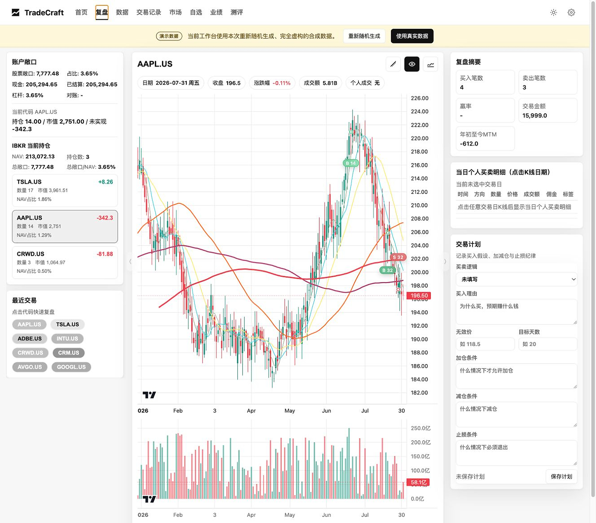

<p align="center">
  <a href="https://github.com/Jincrediblez/TradeCraft_opensource/blob/main/TradeCraft_%E7%B3%BB%E7%BB%9F%E5%8A%9F%E8%83%BD%E6%89%8B%E5%86%8C_zh-CN.pdf"><strong>TradeCraft 系统功能手册（中文 PDF）</strong></a>
</p>

> **TradeCraft 不荐股，不预测，不下单。** 它只帮你把自己的交易看清楚，然后一点一点打磨自己的交易体系。

## 市场不是交易者最大的盲区，自己才是

一个月赚钱，不代表过程值得复制；一次亏损，也不一定说明决策是错的。主动交易真正困难的，通常不是找到更多信息，而是弄清楚自己的盈利究竟来自哪里，又为什么会犯同样的错误。

TradeCraft 帮你持续追问：交易是否按计划执行？进出场质量如何？盈利和亏损真正来自哪里？有没有陷入过度交易？要回答这些问题，先要把已有信息连接起来：

- 成交记录散落在券商报表里；
- 当时的市场环境留在图表上；
- 原始计划藏在笔记里，甚至只存在于记忆中；
- 反复出现的问题能够感觉到，却很难被量化；
- 最后的改进往往只剩下一句“下次更有纪律”。

TradeCraft 把这些碎片放进同一个复盘闭环：还原每笔交易，解释账户结果从哪里来，区分结果与过程，并把一个确认的问题转化为未来 20 个交易日可以验证的规则。

你的交易工作区默认保存在本机。TradeCraft 免费、开源，不需要 TradeCraft 云账户。

| 当复盘卡在这里 | TradeCraft 帮你走向这里 |
|---|---|
| “这次赚了钱，但不知道什么能力可以复制。” | 分开观察市场 beta、选股、执行、仓位和集中度。 |
| “每次回忆这笔交易，版本都不太一样。” | 把 BUY / SELL 成交证据直接放回价格图表。 |
| “系统给了一个分数，却没有告诉我原因。” | 从每个测评发现下钻到完整交易回合和底层成交。 |
| “日志记了很多问题，行为却没有变化。” | 把确认的问题转化为一条可度量的 20 个交易日铁律。 |
| “我不想把完整交易历史上传到另一个平台。” | 数据保存在本机，不需要 TradeCraft 云账户，也不包含遥测。 |

## TradeCraft 做什么

TradeCraft 把券商导出文件转换成结构化、以证据为核心的交易复盘。它不会把所有问题压缩成一个分数，而是把四件事分开回答：

1. **结果：** 到底是什么驱动了账户和每笔交易的结果？
2. **过程：** 入场、退出、仓位、集中度和选股是否合理？
3. **行为：** 哪些有益或有害的模式正在反复出现？
4. **证据质量：** 哪些已经确认，哪些只是怀疑，哪些暂时还不能判断？

TradeCraft 不是券商、信号服务或自动交易系统。它不登录券商账户、不下单、不预测价格，也不会把你的投资组合上传到 TradeCraft 云端。服务只监听 `127.0.0.1`，工作区数据保存在本机，并且不包含遥测。

> **重要提示：** TradeCraft 是研究和复盘软件，不构成投资建议。详见 [DISCLAIMER.md](DISCLAIMER.md)。

## 从交易日志，到真正的学习闭环

普通交易日志通常停在“发生了什么”。TradeCraft 更关注如何让这次复盘真正影响下一次决策：

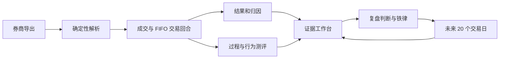

确定性数据管线始终是事实来源。可选 AI 只负责总结当前测评快照，不负责计算收益、匹配交易或生成底层评分。

## 功能预览

这些界面不是为了展示更多数字，而是帮助主动交易者更快回答三个问题：发生了什么、为什么会发生、下一次准备改变什么。

### 复盘：把成交放回当时的行情

在同一张图上查看 K 线、成交量、均线、BUY / SELL 标记和成交明细，减少依赖记忆还原交易的偏差。


### 自选新增：把临时想法变成结构化研究对象

记录关注标的、分组、颜色和触发条件，让盘中发现能够进入后续研究与复盘队列。

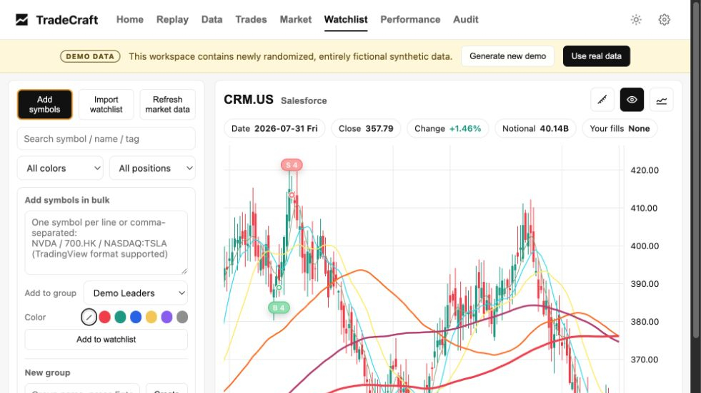

### 交易记录：从结论回到底层成交

按标的核对日期、方向、数量、价格和佣金，为归因、测评和人工判断提供可追溯的事实基础。

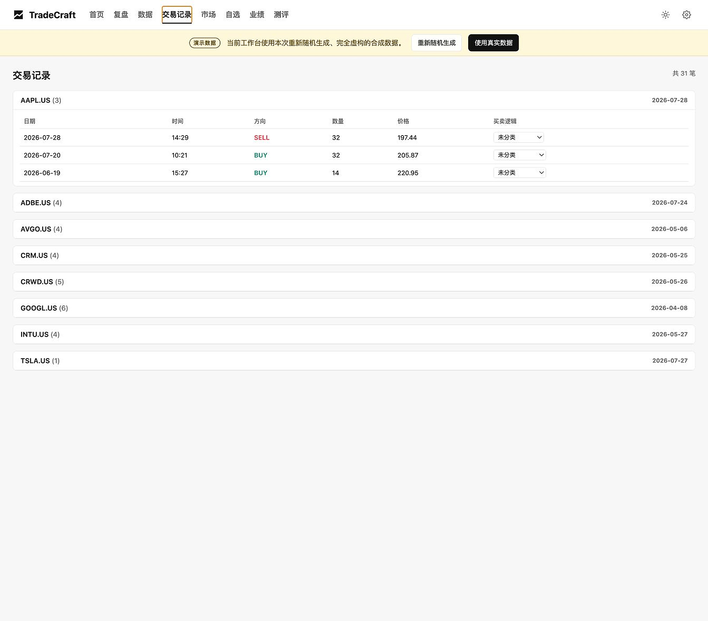

### 业绩：关注净值路径，而不只是最终盈亏

把月度净值和收益变化放在时间轴上，辨别结果来自持续积累、单次大赚，还是回撤后的偶然修复。

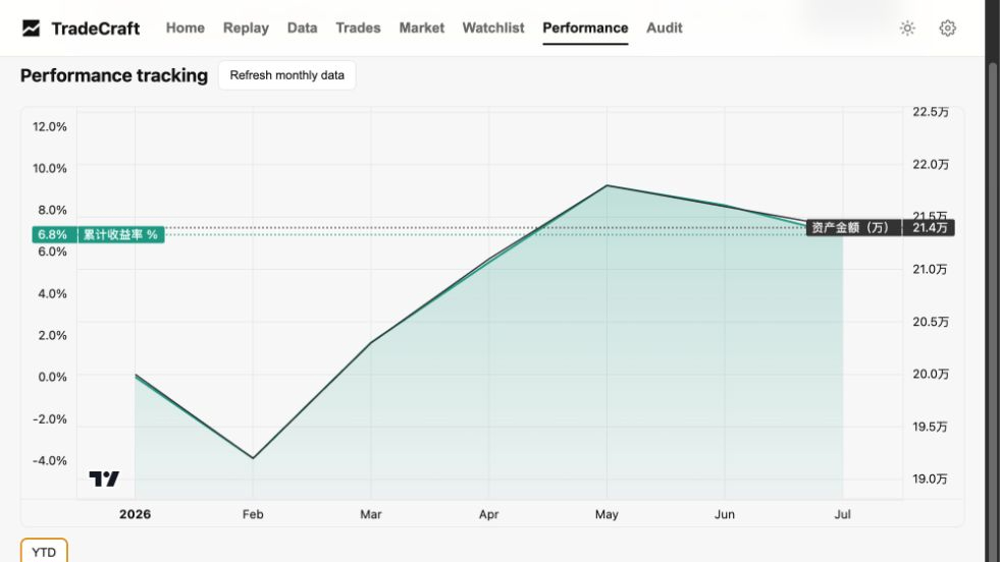

### 数据排行：先找到资金与注意力的集中地

通过成交额和成交笔数排行，快速识别最占用资本、时间与决策精力的标的。

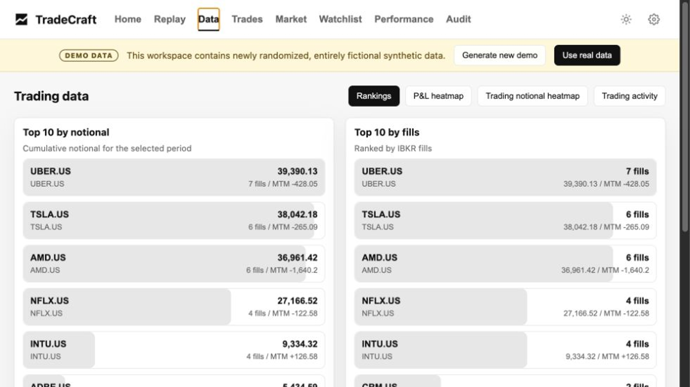

### 盈亏热力图：一眼识别结果贡献集中度

用面积表达相对贡献、颜色表达盈亏方向，快速看清哪些标的主导了组合结果。

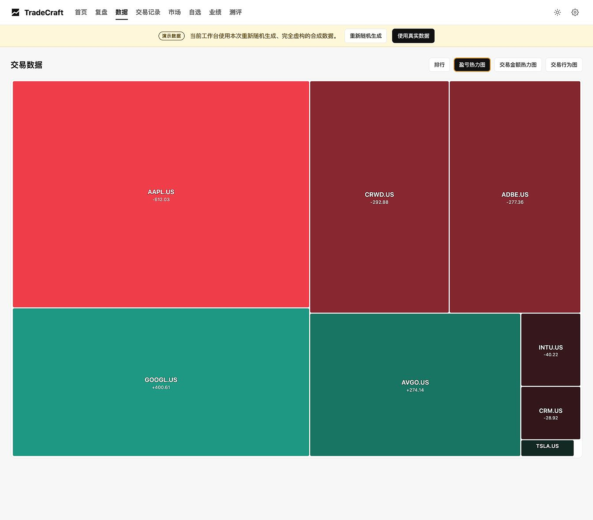

### 交易金额热力图：检查资本配置是否匹配判断

将交易金额可视化，暴露高换手、过度集中以及“观点很弱、仓位很大”等资本分配问题。

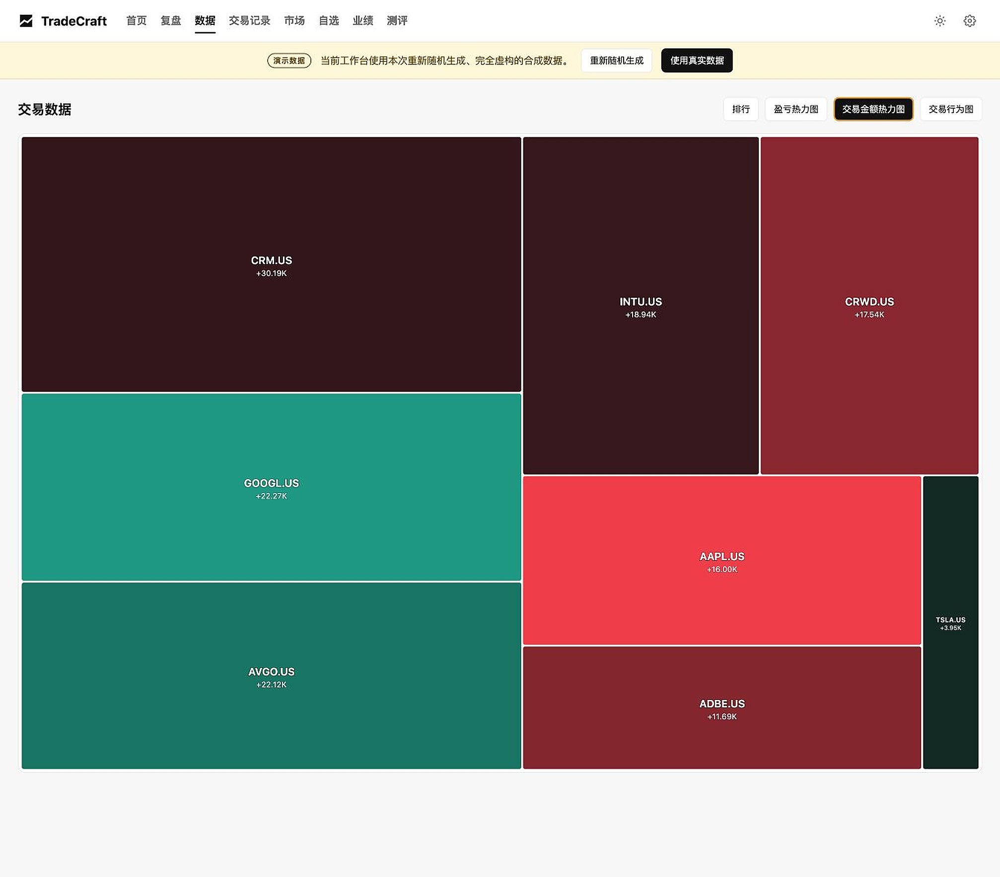

### 交易行为图：识别频率与情绪化爆发

把成交次数和交易金额放回时间轴，帮助发现过度交易、冲动加速和异常活跃时段。

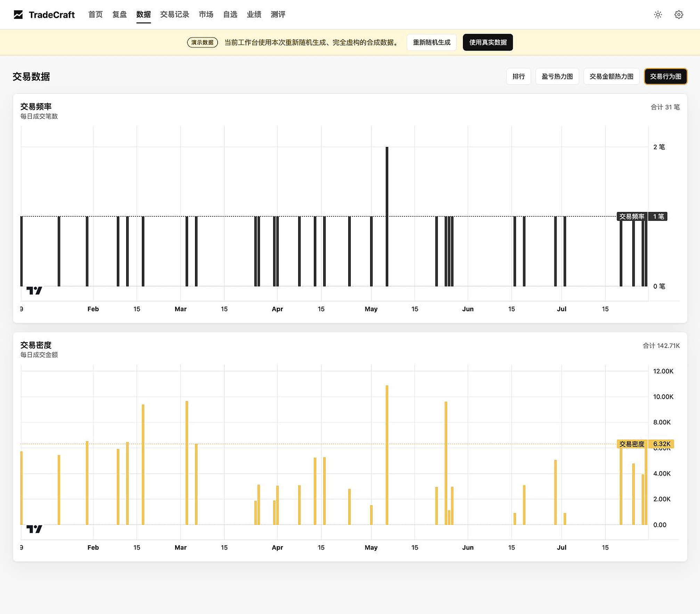

### 市场背景：把个股表现放回市场广度

通过 Nasdaq 热力图观察科技成长股的整体环境，避免把市场 beta 错认为个人选股能力。

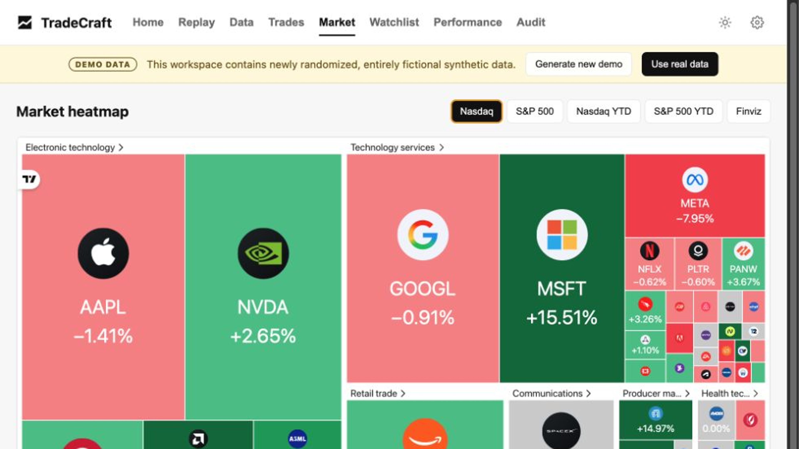

### 测评总览：把结果、过程、行为和可信度分开

同一工作台中查看收益归因、过程风险、行为模式和证据质量，避免用单一分数替代真正的复盘。

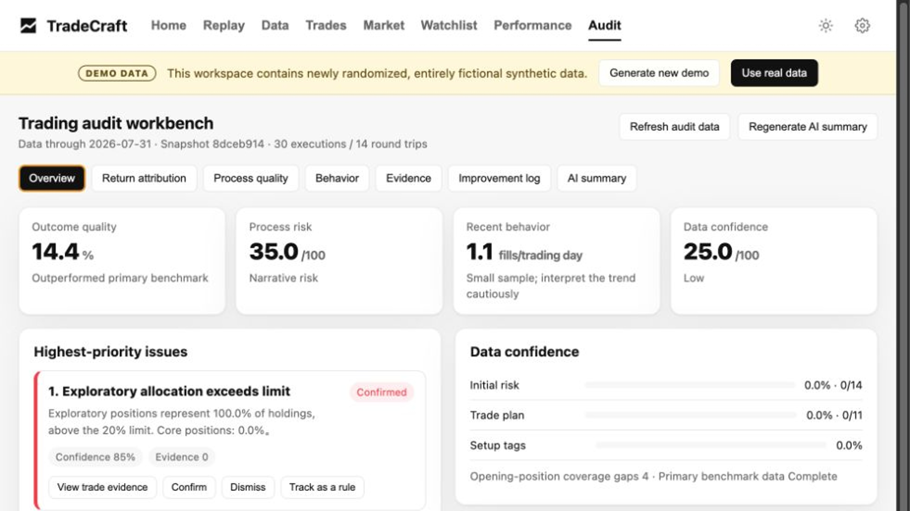

### AI 总结：压缩信息，但不替代事实计算

AI 只总结当前确定性测评快照；底层收益、FIFO 回合和风险维度仍由可审计的数据管线生成。

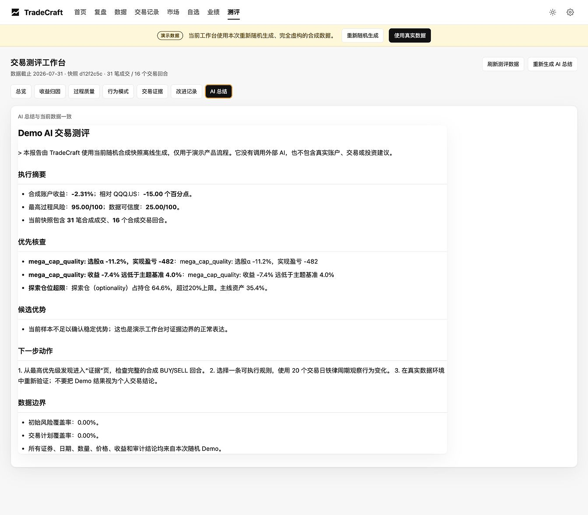

## 页面地图

TradeCraft 是一个无前端构建步骤的单页应用，共有九个主要页面。

| 页面 | 解决的问题 | 主要功能 |
|---|---|---|
| **首页** | 今天最值得复盘什么？ | 账户快照、股票敞口、现金、回撤、区间收益、数据新鲜度、复盘队列和盈亏贡献。 |
| **复盘** | 一只股票的决策过程是怎样发生的？ | 日 K、成交量、均线、BUY/SELL 标记、成交明细、日期/区间导航、测量工具、交易计划和复盘笔记。 |
| **数据** | 把整个交易账本当作数据集看，会看到什么？ | 成交额与成交笔数排行、盈亏贡献、热力图、交易强度、交易密度和其他品种盈亏。 |
| **交易记录** | 原始成交是否完整、如何分类？ | 按股票分组的 fill 记录、日期、方向、数量、价格、佣金、setup 标签和备注。 |
| **市场** | 当前交易处于怎样的市场背景？ | TradingView Nasdaq/S&P 500 热力图、YTD 视图和 Finviz 入口；这些第三方组件需要联网。 |
| **自选** | 如何维护本地研究队列？ | SQLite 分组、拖拽排序、颜色、搜索、批量操作、右键菜单、TradingView 文本导入、图表和触发条件。 |
| **业绩** | 账户净值路径和月度变化如何？ | 月度净值、月收益、YTD/累计收益，以及本地业绩工作簿。 |
| **测评** | 结果、过程、行为和数据可信度分别如何？ | 四类记分卡、基准相对收益、七维风险、交易证据、发现确认/驳回、铁律周期和可选 AI 总结。 |
| **设置** | 如何控制本地工作区？ | 语言、默认区间/代码、刷新间隔、Kimi 模型、基准、数据导入、刷新和 Watchlist 触发器。 |

完整的页面与子标签说明见[图文功能手册 PDF](TradeCraft_系统功能手册_zh-CN.pdf)。

## 核心能力

### 单票复盘

复盘页面把市场走势与实际成交证据放在一起。选择股票和日期后，可以查看：

- 复权日线 OHLCV 和成交量；
- 多组移动平均线；
- 与 fill 对应的 BUY / SELL 标记；
- YTD、年度和自定义区间；
- 图表导航与测量工具；
- 当前交易计划、无效价、目标持有期、setup 分类和复盘补录。

行情会缓存在本地。Demo 模式下，复盘只读取随机生成的离线合成 K 线。

### FIFO 回合匹配与归因

TradeCraft 使用确定性 FIFO 规则把成交记录组合成完整交易回合，并进一步计算：

- 已实现盈亏与持有天数；
- 当前持仓对账；
- 股票、主题和 setup 归因；
- 账户结果与基准相对表现；
- 与底层成交记录关联的入场、退出证据。

生成结果按区间保存，因此当前 YTD 与已经冻结的历史年度可以独立查看。

### 七维交易测评

测评分数代表风险：**0 表示当前观察到的过程风险较低，100 表示风险较高**。七个维度及归一化权重为：

| 维度 | 权重 | 观察内容 |
|---|---:|---|
| 交易摩擦 | 20.45% | 反复进出、过短持有期和不必要的换手。 |
| 选股质量 | 20.45% | 不同主题或股票组的选股 alpha 与实际盈亏。 |
| 入场质量 | 15.91% | 入场时机、追高程度和入场后的不利走势。 |
| 尾部风险 | 15.91% | 集中度、仓位大小和大额亏损暴露。 |
| 主题判断 | 9.09% | 资金是否配置到了预期的市场主线。 |
| 叙事热度 | 9.09% | 缺乏证据支撑的 optionality / FOMO 暴露。 |
| 退出质量 | 9.09% | 过早退出、趋势破坏和卖出后的延续走势。 |

表格权重经过四舍五入；程序内部的归一化权重合计为 100%。

测评工作台会明确区分：

- 有当前证据支持的**已确认发现**；
- 需要更多观察的**疑似发现**；
- 不能升级为结论的**数据不足**；
- 尚未被证明为稳定策略的**候选优势**。

每个发现都可以下钻到完整 BUY/SELL 交易回合，由用户确认或驳回，并转化成一条在未来 20 个交易日持续跟踪的铁律。

## 快速开始

TradeCraft 支持 Python 3.11 和 3.12。

```bash
git clone https://github.com/Jincrediblez/TradeCraft_opensource.git
cd TradeCraft_opensource

python3 -m venv .venv
source .venv/bin/activate
python -m pip install -r requirements.txt

python app/main.py
```

打开 [http://127.0.0.1:8888](http://127.0.0.1:8888)。

也可以使用：

```bash
make install
make run
make test
make smoke
```

项目没有 Node.js 构建步骤；Python 服务直接提供应用和已经固定版本的浏览器依赖。

## 首次启动 Demo

空工作区会自动进入 Demo 模式。每次生成或重置都会创建一套新的、内部一致的随机合成数据：

- 股票代码从公开通用代码池中随机选择；
- 交易日期、方向、数量、价格、佣金和交易回合重新随机生成；
- 账户金额、持仓、现金、敞口、盈亏、业绩、自选股、测评发现和 K 线全部虚构；
- 不生成券商账号；
- 不从真实工作区复制、缩放、变形或套用原有模式。

Demo 激活期间，页面顶部会持续显示黄色“演示数据”横条。

| 接口 | 行为 |
|---|---|
| `GET /api/demo/status` | 返回 Demo 状态、generation ID、区间、股票和文件数量。 |
| `POST /api/demo/reset` | 删除当前合成 manifest，并生成一套不同的随机工作区。 |
| `POST /api/demo/exit` | 只删除 Demo manifest 记录的文件，并关闭自动 seed。 |

退出 Demo 之前，真实数据上传会被拒绝，因此合成数据与真实数据不会混合。

Demo 模式下仍可使用 TradingView 和 Finviz。测评页面包含根据当前合成快照离线生成的中英文 Demo AI 总结，不调用 Kimi 或其他 AI 服务。

## 导入真实 IBKR 数据

1. 在黄色 Demo 横条中点击“使用真实数据”，确认退出。
2. 打开“设置 → 数据更新”。
3. 上传支持的文件，或将文件放入 `data/inbox/`。
4. 点击“更新数据”。
5. 在首页检查数据截止日期，然后进入复盘、业绩和测评。

支持的输入：

- IBKR `.tlg` 股票成交日志；
- Activity Statement CSV：账户快照、持仓和 MTM；
- Transaction History CSV：作为成交记录补充；
- MTM Summary CSV；
- `data/inbox/` 或 `TRADECRAFT_PERFORMANCE_FILE` 指定的可选业绩工作簿。

刷新过程会解析 inbox、对账持仓、生成分区间状态、更新测评和本地行情缓存，并归档已处理文件。

以下运行时路径已经被 Git 忽略：

```text
.env
data/inbox/
data/historical_inbox/
data/archive/
data/state/
cache/kline/
logs/
server.log
```

不要提交券商导出、生成状态、工作簿、数据库、日志或密钥。
每个 TradeCraft checkout 都应拥有独立的 `.env`、`data/`、`cache/` 和
`logs/`；不要从另一个 TradeCraft 仓库复制这些运行时目录或凭据。

## 多语言

界面支持 English 和简体中文：

- `auto`：跟随 `navigator.languages`；`zh*` 使用简体中文，其余语言回退英文；
- `en`；
- `zh-CN`。

用户选择会保存在本地。API 接受 `Accept-Language` 或 `?lang=en` / `?lang=zh-CN`，并返回 `Content-Language`。

浏览器词典位于 `static/locales/`，可选 AI prompt 按语言分开：

```text
prompts/critique_audit_en.md
prompts/critique_audit_zh-CN.md
```

## 可选 Kimi 总结

没有 API key 时，确定性解析、复盘、归因、评分、证据、Demo 和 Demo AI 均可完整使用。

为真实工作区启用 Kimi：

```bash
cp .env.example .env
chmod 600 .env
```

请为当前 checkout 使用独立的 API key，不要复用其他 TradeCraft 仓库的凭据。

然后设置：

```dotenv
KIMI_API_KEY=your_key_here
```

只有用户主动点击“生成 AI 总结”时才会调用 Kimi。Prompt 与当前测评快照绑定，报告按语言缓存；外部服务失败不会使确定性工作台失效。

## 架构与数据流

```text
浏览器 http://127.0.0.1:8888
        │
        ├── static/index.html + static/i18n.js
        │
        └── Python HTTP 服务 app/main.py
                │
                ├── IBKR 解析与状态校验
                ├── FIFO 持仓匹配
                ├── 归因与七维评分
                ├── 证据优先的测评工作台
                ├── 本地 Watchlist 数据库
                └── 行情缓存与可选 AI
```

主要目录：

```text
app/                    HTTP 服务和确定性计算引擎
config/                 测评阈值与主题配置
prompts/                中英文可选 AI prompt
static/                 无构建前端、语言词典和本地 JS 依赖
docs/                   产品文档与合成数据截图
tests/                  单元、集成、隐私、多语言、Demo 和 UI 测试
scripts/                本地运行与文档生成工具
```

Lightweight Charts 4.2.3 和 D3 7.9.0 已固定版本并本地托管，许可证随仓库提供。市场页面会加载第三方 TradingView/Finviz；其他应用界面不依赖 JavaScript CDN。

## API 概览

主要只读接口：

```text
/api/health
/api/periods
/api/overview
/api/account-snapshot
/api/replay
/api/trades
/api/watchlist
/api/performance
/api/audit
/api/audit/workbench
/api/audit/evidence
/api/audit/report
/api/settings
/api/demo/status
```

写接口覆盖 Demo 生命周期、上传、刷新、交易计划、setup 标签、Watchlist、测评判断、铁律周期、交易回合补录和可选报告生成。

服务没有身份验证，因为它只应监听本机回环地址。没有额外认证和权限控制时，不要将服务绑定到公共或共享网络。

## 开发

```bash
python -m pip install -r requirements-dev.txt
pytest -q
python -m pip_audit -r requirements.txt
python -m playwright install chromium
```

提交 PR 之前：

- 运行完整测试；
- 验证干净环境首次启动 Demo；
- 验证中英文；
- 检查没有真实姓名、账号、交易、收益、本机路径、私人邮箱、密钥、数据库、表格或日志；
- 确保运行时数据没有进入 Git。

更多信息见 [CONTRIBUTING.md](CONTRIBUTING.md)、[SECURITY.md](SECURITY.md) 和 [THIRD_PARTY_NOTICES.md](THIRD_PARTY_NOTICES.md)。

## 隐私与安全边界

- 服务只监听 `127.0.0.1`；
- 不登录券商、不下单；
- 不包含 TradeCraft 遥测；
- 运行时数据和密钥被 Git 忽略；
- Demo 与真实数据互斥；
- 外部请求仅限已配置的行情/AI 能力和明确可见的第三方市场组件；
- 可选 AI 必须由用户主动触发。

安全问题请按照 [SECURITY.md](SECURITY.md) 私下报告。

## TradeCraft 背后的故事

我没有编程背景。TradeCraft 源于我在交易中反复遇到的一个问题：如何系统地复盘自己的决策，而不只是记录盈亏。

借助 AI 辅助开发，我从自己的真实交易流程出发构建了第一个版本，并在日常使用中持续迭代完善。

如今，TradeCraft 已成为我日常交易复盘流程的一部分。

## 许可证

Copyright TradeCraft contributors.

项目使用 [Apache License 2.0](LICENSE)。第三方声明见 [THIRD_PARTY_NOTICES.md](THIRD_PARTY_NOTICES.md)。
