# TradeCraft Illustrated User Manual

Version 0.1.0 - English edition

TradeCraft is a local-first trade review system for active traders. It reconstructs trades from brokerage exports, places executions back into market context, separates outcome from process, and turns confirmed findings into rules that can be checked over the next 20 trading days.

> TradeCraft does not recommend stocks, predict markets, connect to a brokerage account, or place orders. It is research and journaling software, not investment advice.

All account values, trades, positions, returns, symbols, and audit conclusions shown in this manual come from a randomized synthetic Demo workspace. They are not real personal data.

The interface screenshots use the standard 16:9 widescreen aspect ratio and are stored at 3840 × 2160 pixels for clear viewing on high-density displays. The capture viewport is 1920 × 1080 CSS pixels at 2× device scale.

## 1. Install and start TradeCraft

TradeCraft supports Python 3.11 and 3.12.

```bash
git clone https://github.com/Jincrediblez/TradeCraft_opensource.git
cd TradeCraft_opensource

python3 -m venv .venv
source .venv/bin/activate
python -m pip install -r requirements.txt
python app/main.py
```

Open `http://127.0.0.1:8888` in a desktop browser. The service is intentionally bound to the local loopback interface.

Convenience commands are also available:

```bash
make install
make run
make test
make smoke
```

## 2. First run and Demo mode

An empty workspace starts in Demo mode automatically. The yellow `DEMO DATA` banner means that the current account, trades, positions, performance, Watchlist, audit findings, and cached candles are entirely fictional.


Use Demo mode to learn the workflow safely:

1. Start on Home and identify the highest-priority symbol.
2. Open Replay to inspect the chart and the actual synthetic fills together.
3. Review Data and Performance to understand concentration and the account path.
4. Open Audit and drill from a finding into its underlying evidence.
5. Generate a new Demo at any time to replace the entire synthetic workspace.

`Generate new demo` creates a new internally consistent dataset. `Use real data` exits Demo mode and removes only files listed in the Demo manifest. Real uploads are rejected until Demo mode is exited, which prevents synthetic and real records from being mixed.

## 3. Import real IBKR data

1. Click `Use real data` in the Demo banner and confirm the exit.
2. Open `Settings -> Data update`.
3. Upload supported files, or place them in `data/inbox/`.
4. Click `Refresh data`.
5. Return to Home and confirm the data-through date and execution count before interpreting results.

Supported inputs include:

- IBKR `.tlg` stock trade logs;
- Activity Statement CSV files for snapshots, positions, and mark-to-market values;
- Transaction History CSV files as a fill fallback;
- MTM Summary CSV files;
- an optional performance workbook in `data/inbox/` or configured with `TRADECRAFT_PERFORMANCE_FILE`.

Never commit broker exports, generated state, workbooks, local databases, logs, or `.env` files. Each checkout should own its own runtime workspace.

## 4. Daily review workflow

### 4.1 Home - decide what deserves attention first

Home combines net asset value, stock exposure, cash, drawdown, leverage, period return, data freshness, a review queue, and the largest P&L contributors. Confirm data freshness first, then choose one to three symbols that deserve a deeper review.


### 4.2 Replay - reconstruct the decision from evidence

Replay places adjusted daily candles, volume, moving averages, BUY and SELL markers, and fill-level records on one timeline. The left side summarizes account exposure and recent symbols. The right side contains the selected day details and the trade-plan form.


Recommended Replay sequence:

1. Select the symbol and date that matter.
2. Check the market position of every fill instead of relying on memory.
3. Compare the entry and exit with the original invalidation level and holding horizon.
4. Record the thesis, add/reduce conditions, stop condition, setup tag, and review note.
5. Save the plan so later audit evidence can distinguish missing data from a process error.

### 4.3 Trades - return to the underlying fills

Trades groups executions by symbol. Expand a symbol to inspect dates, times, sides, quantities, prices, and setup classifications. This is the fill-level source for FIFO round trips and evidence drill-down.


### 4.4 Watchlist - maintain a local research queue

Watchlist is a local, SQLite-backed research queue with groups, colors, sorting, search, charts, position context, and trigger fields. Use it to separate candidates from active positions and to record what must happen before a candidate becomes actionable.

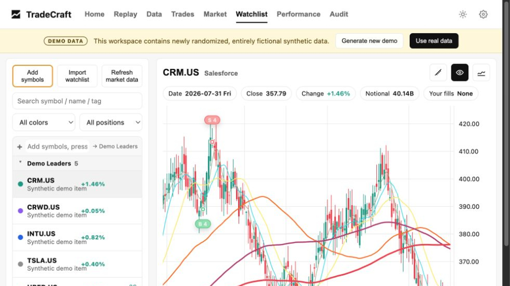

### 4.5 Add symbols - build a candidate pool efficiently

Click `Add symbols` to add one or more tickers, select a target group, assign a color, or create a new group. The bulk field accepts one symbol per line, comma-separated symbols, and common TradingView Watchlist formats.


## 5. Review the account path

### 5.1 Performance - inspect the path, not only the ending value

Performance shows monthly account values, monthly returns, cumulative returns, and YTD returns. Use it to distinguish steady progress from a result dominated by one large win or a recovery after a deep drawdown.


### 5.2 YTD view - isolate the current year

Click `YTD` to focus the chart on the current year. This is useful when a strategy or risk process changed recently and older history would dilute the comparison.

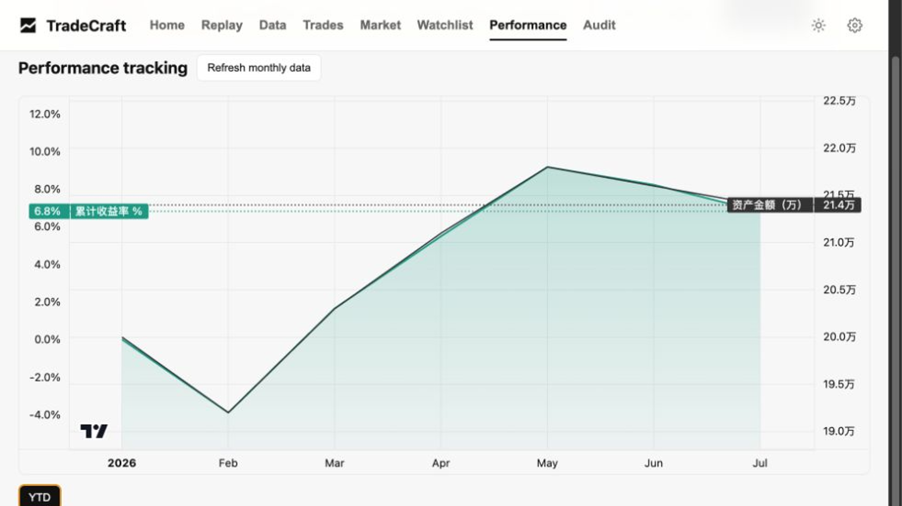

## 6. Understand capital and attention

### 6.1 Rankings

Rankings show the symbols with the largest trading notional, the most fills, the largest gains and losses, and non-stock instrument P&L. Use the page to compare where you believed your attention went with where capital and executions actually went.


### 6.2 P&L heatmap

The P&L heatmap uses area for relative contribution and color for direction. It makes result concentration visible immediately.


### 6.3 Trading notional heatmap

The trading-notional heatmap shows cumulative traded capital. Compare it with P&L contribution to identify excessive turnover, weak capital efficiency, or sizing that did not match conviction.


### 6.4 Trading activity

Trading activity plots daily fill count and traded amount over time. Look for bursts of frequency or notional that may indicate overtrading, emotional acceleration, or an unusual event window.


## 7. Add market context

The Market page uses visible third-party TradingView and Finviz surfaces. These widgets require network access but do not receive local account or execution data from TradeCraft.

### 7.1 Nasdaq daily heatmap


### 7.2 S&P 500 daily heatmap

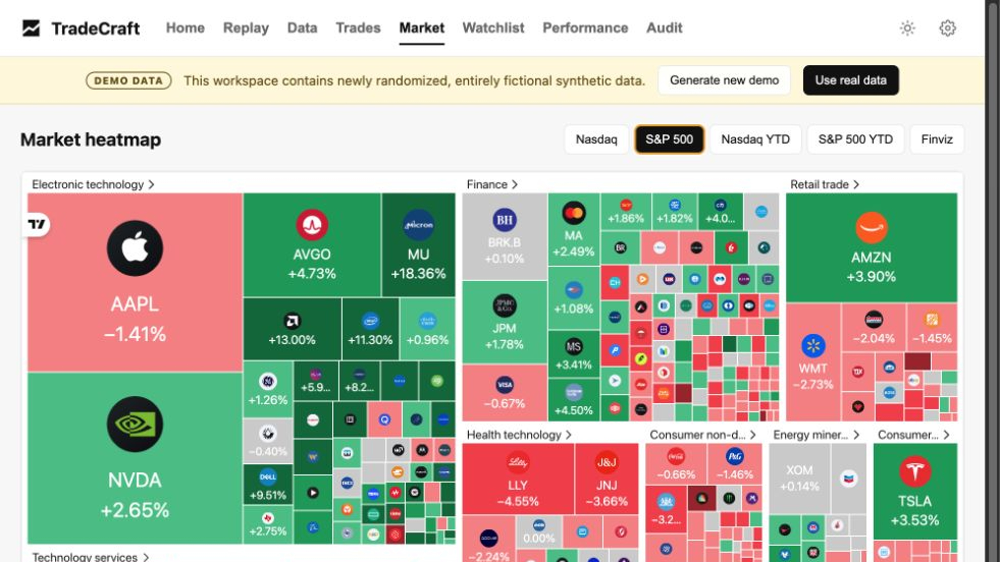

### 7.3 Nasdaq YTD heatmap

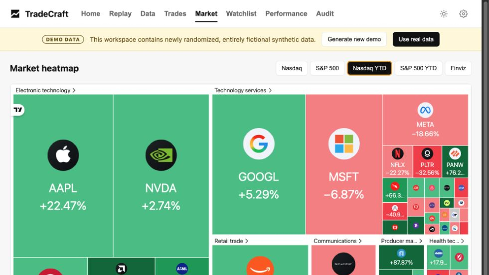

### 7.4 S&P 500 YTD heatmap

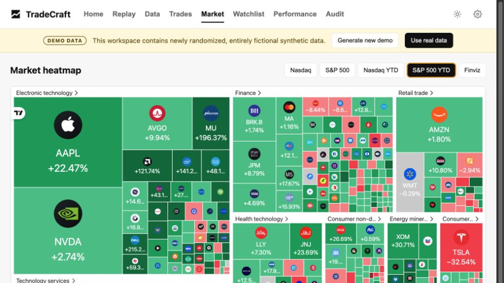

### 7.5 Finviz map

Finviz opens in a separate browser tab. Use it as an additional external market-map view.

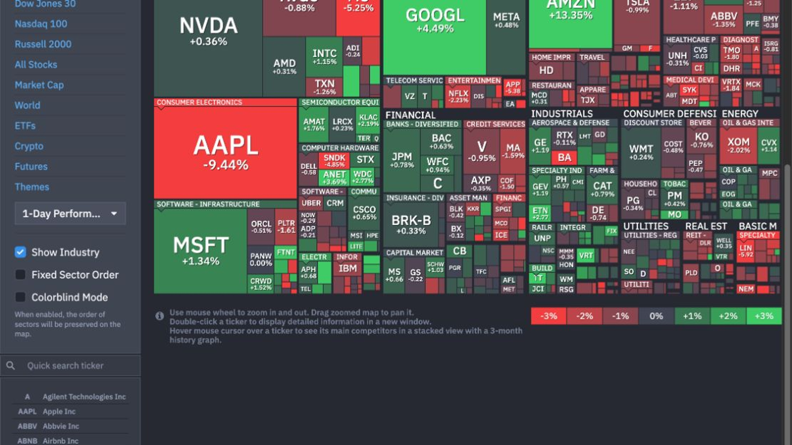

Do not interpret broad market strength as proof of stock-selection skill. Compare account results with the selected benchmark and use the heatmaps only as context.

## 8. Use the evidence-first Audit workbench

The Audit score is a risk diagnostic: 0 means lower observed process risk and 100 means higher risk. It is not a personality score or a return forecast. Every finding should be traceable to the current dataset and complete trade evidence.

The workbench keeps four questions separate:

- Outcome: what drove the account and trade results?
- Process: were entry, exit, sizing, concentration, and selection sound?
- Behavior: which patterns changed or repeated?
- Confidence: which conclusions are supported, suspected, or blocked by missing data?

### 8.1 Overview

Overview presents outcome, process, behavior, and confidence scorecards together with the highest-priority findings and the current improvement rule.


### 8.2 Return attribution

Return attribution compares account TWR with the primary and reference benchmarks, then shows setup results and the largest positive and negative contributors.

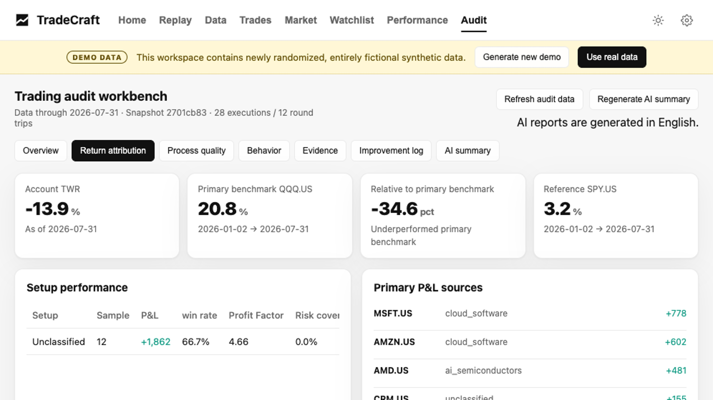

### 8.3 Process quality

Process quality reviews seven weighted risk dimensions: churn and friction, stock selection, entry quality, tail risk, theme judgment, narrative hype, and exit quality.

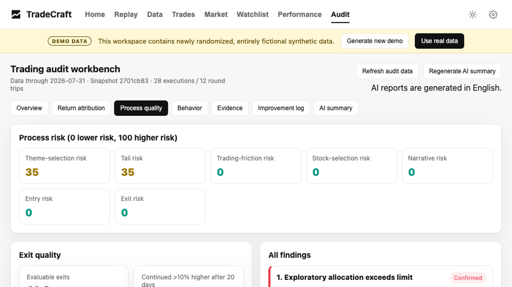

### 8.4 Behavior

Behavior compares the most recent 20 active trading days with the previous 20-day window. Use it to identify changes in frequency, holding period, size, and win rate.

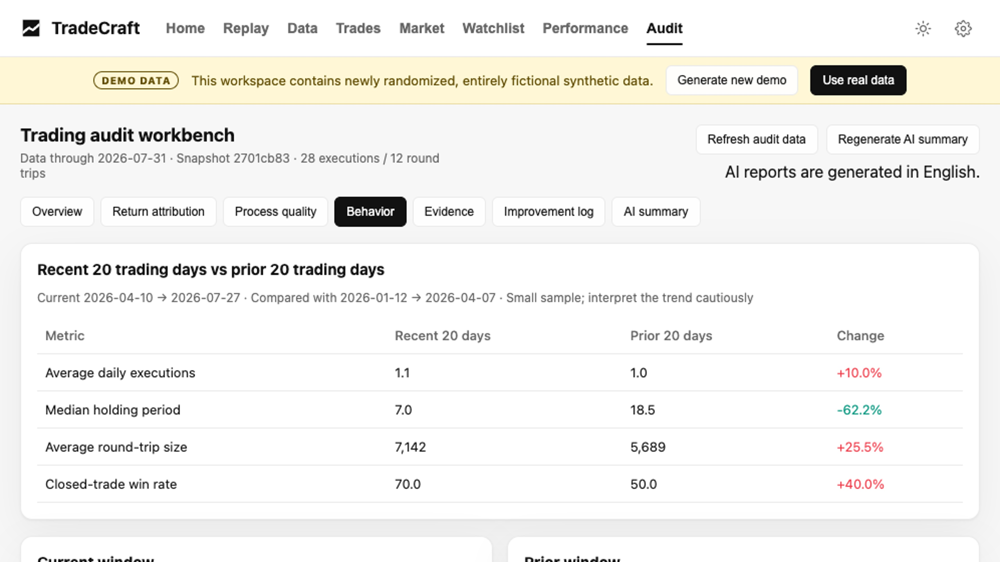

### 8.5 Evidence

Evidence drills from a finding into complete BUY and SELL round trips, related fills, holding days, and realized P&L. Add missing plan or review context before confirming a conclusion.

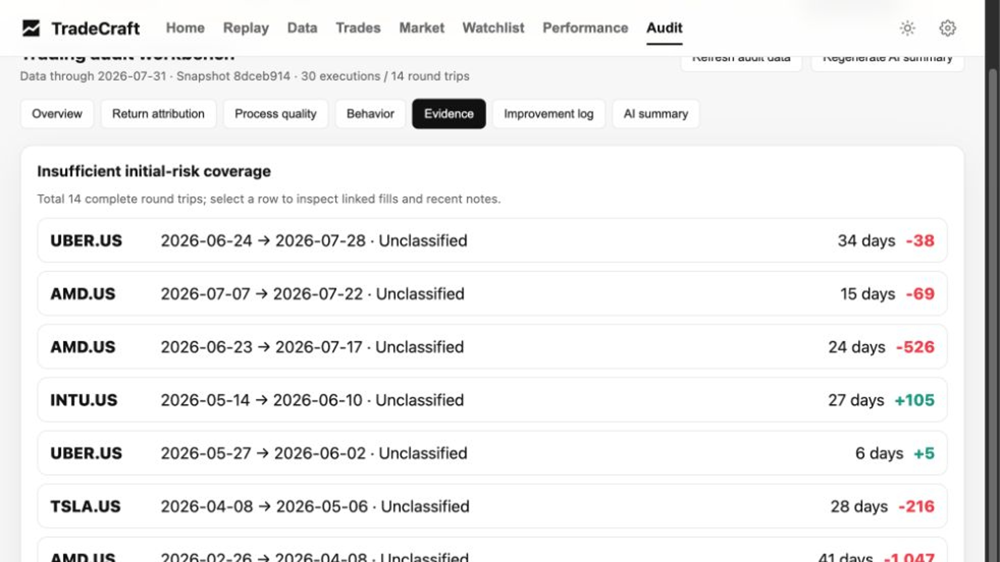

### 8.6 Improvement log

The improvement log records confirmed or dismissed findings and tracks a selected rule over the next 20 trading days. A useful rule has a baseline, target, measurement window, and completion result.

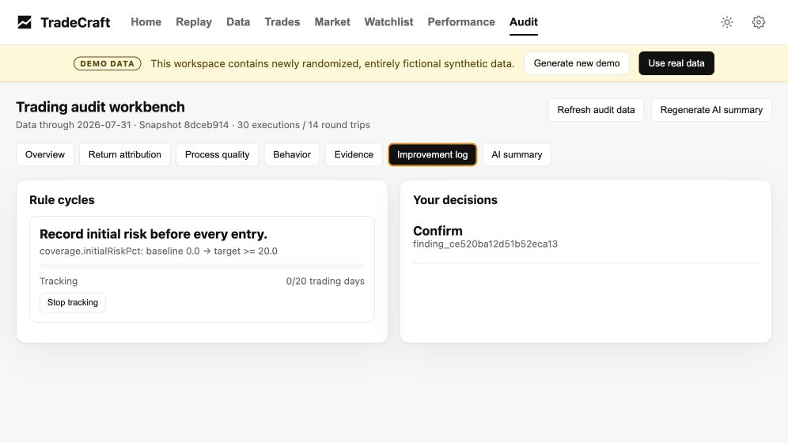

### 8.7 AI summary

The optional AI summary compresses the current deterministic audit snapshot. It does not calculate P&L, FIFO matching, attribution, or risk scores. In Demo mode, the English summary is generated offline and no external provider is called.


For a real workspace, Kimi is called only after the user explicitly selects `Generate AI summary` and a local API key is configured.

## 9. Settings

Settings controls language, default period, default symbol, market-data refresh interval, Kimi model, theme benchmark, audit benchmarks, data upload and refresh, and Watchlist triggers.

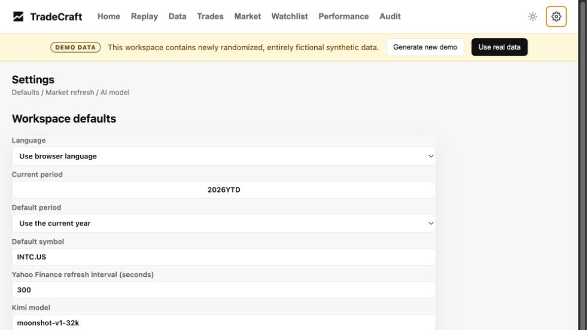

The browser UI language options are `English` and `Simplified Chinese`.
English is the default, and the selected value is saved locally. TradeCraft
does not inspect the browser language. API responses, CLI output, stored state,
logs, documentation, and AI reports remain English regardless of the UI choice.

## 10. Recommended review cadence

Every trading day:

- verify data freshness, exposure, cash, drawdown, and priority symbols on Home;
- review one to three important trades in Replay;
- resolve one high-priority Audit finding or add the missing evidence;
- update the Watchlist condition that matters most.

Every week:

- compare P&L contribution with trading notional and activity;
- remove stale Watchlist candidates and update groups or triggers;
- compare current market breadth with YTD leadership;
- check whether recent behavior differs from the previous 20-day window.

Every month:

- review the account path, monthly return, cumulative return, and drawdown recovery;
- recheck all seven process-risk dimensions;
- close or extend completed 20-day rule cycles;
- treat candidate strengths as unproven until sample size and risk coverage are sufficient.

## 11. Privacy, networking, and AI boundaries

- The service listens on `127.0.0.1` by default.
- TradeCraft does not log in to a broker or place orders.
- There is no TradeCraft telemetry or TradeCraft cloud account.
- Runtime data and secrets are ignored by Git.
- Demo and real data are mutually exclusive.
- TradingView and Finviz are visible third-party network surfaces.
- Optional AI requires an explicit user action.
- Core parsing, FIFO matching, attribution, evidence, and scoring remain deterministic.

## 12. Troubleshooting

The page does not open:

- confirm that `python app/main.py` is still running;
- open `http://127.0.0.1:8888`, not a public network address;
- check `/api/health` for the resolved root, Python executable, and data state.

The interface is in the wrong language:

- open Settings and select the intended language explicitly;
- reload the page after saving;
- confirm that `document.documentElement.lang` is `en` or `zh-CN` when debugging the browser.

Charts or market widgets are empty:

- local Replay and Watchlist charts require cached market data;
- use Settings to refresh local data;
- TradingView and Finviz require network access and may be blocked by browser privacy settings.

Audit findings are marked as insufficient data:

- add trade plans, invalidation levels, initial risk, and review notes;
- refresh the audit snapshot;
- do not upgrade a candidate strength into a proven edge without sufficient history.

## 13. Product boundary

TradeCraft is designed to make important decisions recorded, important conclusions traceable, repeated mistakes measurable, and candidate strengths testable. It does not replace judgment, create trading signals, or guarantee future performance.

See [DISCLAIMER.md](DISCLAIMER.md) for the financial disclaimer and [SECURITY.md](SECURITY.md) for the security policy.
